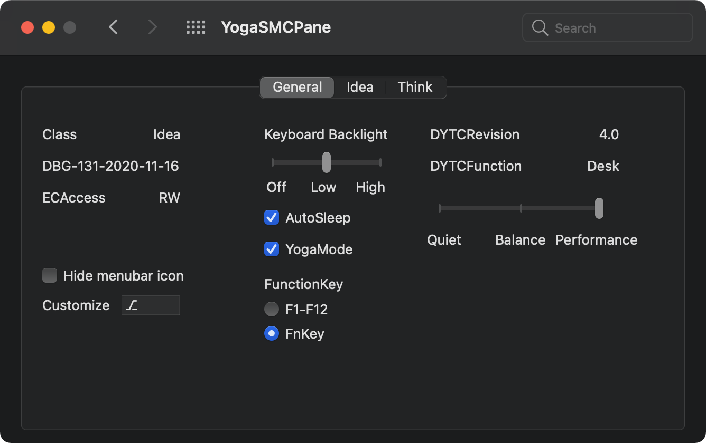
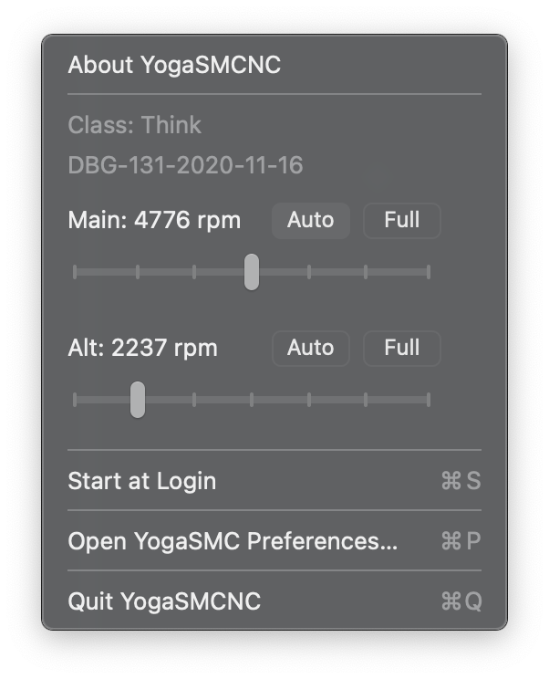

# YogaSMC  

This driver consists of YogaSMC, YogaWMI and YogaVPC.

Each component can be derived for different targets. Currently ThinkPad and IdeaPad series (all other consumer brands) are supported. Support for generic Intel HID event & 5 button array is experimental.

Command to driver can be sent with [ioio](https://github.com/RehabMan/OS-X-ioio), e.g. `ioio -s IdeaVPC ConservationMode true`.

The driver will update the status in ioreg, while details are available in system log, e.g. `log stream --predicate 'senderImagePath contains "YogaSMC"'`. 

Companion userspace apps, YogaSMCPane and YogaSMCNC are also available with GUI configuration and notification service.

## YogaSMC
Allow syncing SMC keys like sensors reading and battery conservation mode.

Based on [acidanthera/VirtualSMC](https://github.com/acidanthera/VirtualSMC/)

### Customized sensor reading
The EC field name for corresponding SMC key is read from Info.plist. If there's no `FieldUnit` object at desired offset, you can add an `OperationRegion` like `SSDT-THINK.dsl` in `SSDTSample`.

### Fan control (WIP)

## YogaWMI
Support for parsing WMI devices and properties. On some devices, it could act as YogaVPC with access to extensive device control method.

(For Thunderbolt WMI interface, see [al3xtjames/ThunderboltPkg](https://github.com/al3xtjames/ThunderboltPkg) instead.)

Based on [the-darkvoid/macOS-IOElectrify](https://github.com/the-darkvoid/macOS-IOElectrify/) ([Dolnor/IOWMIFamily](https://github.com/Dolnor/IOWMIFamily/)) and [bmfparser](https://github.com/zhen-zen/bmfparser) ([pali/bmfdec](https://github.com/pali/bmfdec))

### IdeaWMI
Currently available functions:
- `WMIY` Yoga Mode detection and disabling keyboard/touchpad when flipped
- `WBAT` Extra battery information (requires patching related methods like battery ones)
- `WMI2` Fn+esc (obsolete paper looking function), currently assigned to Fn mode toggle.

### ThinkWMI (WIP)
~~Based on [lenovo/thinklmi](https://github.com/lenovo/thinklmi) ([iksaif/thinkpad-wmi](https://github.com/iksaif/thinkpad-wmi))~~

## YogaVPC
Intercepting events on vendor-specific Virtual Power Controller (VPC) devices and sync states, some instructions are on [project boards](https://github.com/zhen-zen/YogaSMC/projects/).

Currently available functions:
- EC reading
- DYTC setting (available for idea/think, might need appropriate OS version for XOSI)
- Automatic backlight and LED control
- Clamshell mode (need additional patch on `_LID` like  `SSDT-RCSM.dsl` in `SSDTSample`)

| Variant | IdeaVPC  | ThinkVPC | YogaHIDD |
| ---- | ---- | ---- | ---- |
| `_HID` | `VPC2004` | `LEN0268` `LEN0068` | `INT33D5` `INTC1051` |
| Reference | [ideapad-laptop](https://github.com/torvalds/linux/blob/master/drivers/platform/x86/ideapad-laptop.c) | [thinkpad_acpi](https://github.com/torvalds/linux/blob/master/drivers/platform/x86/thinkpad_acpi.c) | [intel-hid](https://github.com/torvalds/linux/blob/master/drivers/platform/x86/intel-hid.c) |
| Hotkey polling | ✅ | ✅ | ✅ (beta) |
| Conservation mode | ✅ | ✅ | N/A |
| Battery threshold | Not supported | ✅ | N/A |
| Charging control | Need testing | Need testing | N/A |
| DYTC | ✅ | ✅ | N/A |
| Fan reading | Need testing | ✅ | N/A |
| Fan control | Need testing | ✅ | N/A |
| Fn lock mode | ✅ | Native | N/A |
| LED control | Not supported | ✅ | N/A |
| Keyboard backlight | ✅ | ✅ | N/A |

### EC reading:
When [Rehabman's](https://www.tonymacx86.com/threads/guide-how-to-patch-dsdt-for-working-battery-status.116102/) battery patching method `RE1B` `RECB` present (or  `SSDT-ECRW.dsl` in `SSDTSample`), desired EC fields can be read using following commands:

- One byte at specific offset: `ioio -s YogaVPC ReadECOffset 0xA4` for field at offset `0xA4`
- Bulk reading: `ioio -s YogaVPC ReadECOffset 0x1006` for `0x10` bytes at offset `0x06` (add total bytes to read before offset)
- Dump whole EC area: `ioio -s YogaVPC ReadECOffset 0x10000`
- Known EC field name: `ioio -s YogaVPC ReadECName B1CY` (no larger than 1 byte due to OS constraint)

## YogaSMCPane
The preference pane provides a graphical user interface for basic information and settings, such as battery conservation mode and backlight.

## YogaSMCNC
The notification application receives EC events and displays them on OSD. Corresonding actions will also be triggered for function keys. The configuration can be customized at `~/Library/Preferences/org.zhen.YogaSMC.plist` after closing the app.

Only a few models support dual fan reading and control, which could be enabled manually via debug prefpane or `SecondThinkFan` in preference plist.

For unknown events in preset, feel free to submit a PR like [#40](https://github.com/zhen-zen/YogaSMC/pull/40).

If you want to add new actions, the easiest approach is to use the `script` action and fill the AppleScript in `option` field. [be295da](https://github.com/zhen-zen/YogaSMC/commit/be295dad333866cf23466d7e068354bc4c1f02ea) is a good example to add it as a built-in action, which may be replaced with native one later.

## Installation
The kext should work out-of-the-box. If you have modified `_QXX` methods before, please remove the patches.

Some features may rely on methods accessing EC. Although it won't affect the core functionality, please consider patching related EC fields larger than 8-bit.

The `YogaSMCAlter.kext` is a variant without SMC keys support and the dependencies of `Lilu` and `VirtualSMC`. It's designed for quick loading / unloading without reboot when debugging. 

## Building
1. Copy latest debug version of [Lilu.kext](https://github.com/acidanthera/Lilu/releases/latest) and [VirtualSMC.kext](https://github.com/acidanthera/VirtualSMC/releases/latest) into the folder
2. `git clone --depth 1 https://github.com/acidanthera/MacKernelSDK`
3. In Xcode, Select build target on upper left and click the button on the left

## Credits
- [Apple](https://www.apple.com) for macOS
- [Linux](https://www.linux.org) for [ideapad-laptop](https://github.com/torvalds/linux/blob/master/drivers/platform/x86/ideapad-laptop.c) and [thinkpad-acpi](https://github.com/torvalds/linux/blob/master/drivers/platform/x86/thinkpad_acpi.c) kernel module  
- [RehabMan](https://github.com/RehabMan) for [OS-X-Voodoo-PS2-Controller](https://github.com/RehabMan/OS-X-Voodoo-PS2-Controller), [OS-X-ACPI-Debug](https://github.com/RehabMan/OS-X-ACPI-Debug), [OS-X-ioio](https://github.com/RehabMan/OS-X-ioio) and DSDT patches
- [vit9696](https://github.com/vit9696) for [VirtualSMC](https://github.com/acidanthera/VirtualSMC)
- [the-darkvoid](https://github.com/the-darkvoid) for [macOS-IOElectrify](https://github.com/the-darkvoid/macOS-IOElectrify)
- [pali](https://github.com/pali) for [bmfdec](https://github.com/pali/bmfdec)
- [benbender](https://github.com/benbender), [1Revenger1](https://github.com/1Revenger1) and other contributors for testing and feedback 
